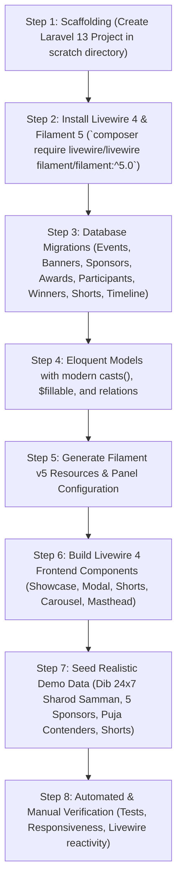

# Implementation Plan: Dib 24x7 Event Microsite (Livewire 4 & Filament 5)

## Goal Description
Build an event microsite frontend and comprehensive contest management backend for **Dib 24x7** using modern Laravel standards:
- **Frontend Microsite**: Built with **Laravel 13 + Livewire 4 + Tailwind CSS + Alpine.js**, delivering instantaneous reactive filtering, responsive ATF carousel, sponsor masthead integration, and interactive candidate/Puja modals without full page reloads.
- **Backend Admin Portal**: Powered by **Filament PHP v5**, providing native panel management, rich form schemas (rich text editors, dual-ratio banner uploads, conditional Puja fieldsets), and interactive relational tables for Events, Banners, Sponsors, Awards, Participants, Winners, and Video Shorts.

---

## Tech Stack Alignment & Compatibility Analysis

```mermaid
graph TD
    subgraph "Core Runtime (PHP 8.3 + Laravel 13)"
        L13[Laravel 13 Core]
        Eloquent[Eloquent ORM + Migrations]
        Storage[Storage Disk: public/events]
    end

    subgraph "Frontend Layer (Livewire 4 + Alpine.js + Tailwind CSS)"
        LW_Masthead[Masthead Component]
        LW_Banner[Responsive ATF Carousel]
        LW_Showcase[Livewire 4 Showcase Component (Reactive Zone / Locality / Shortlist)]
        LW_Modal[Livewire 4 Candidate & Puja Lightbox Modal]
        LW_Shorts[Livewire 4 Video Shorts Lightbox Player]
        LW_Countdown[Countdown Timer Component]
    end

    subgraph "Backend Admin Portal (Filament PHP v5)"
        FilamentPanel[Filament v5 Admin Panel (/admin)]
        Res_Event[EventResource (Toggles, RichEditor, SEO)]
        Res_Banner[BannerResource (Desktop & Mobile Picture Upload)]
        Res_Sponsor[SponsorResource (5-Slot Associate Sponsor Grid)]
        Res_Participant[ParticipantResource (Gallery + Conditional Puja Tabs)]
        Res_Award[AwardResource (Prize Money & Categories)]
        Res_Winner[WinnerResource (Dependent Selects & Ranking)]
        Res_Shorts[VideoShortResource (9:16 Media & Embeds)]
    end

    L13 --> Eloquent
    L13 --> Storage
    LW_Showcase & LW_Modal & LW_Shorts --> Eloquent
    FilamentPanel --> Res_Event & Res_Banner & Res_Sponsor & Res_Participant & Res_Award & Res_Winner & Res_Shorts
    Res_Event & Res_Banner & Res_Sponsor & Res_Participant & Res_Award & Res_Winner & Res_Shorts --> Eloquent
```

> [!NOTE]
> **Compatibility Confirmation:**
> Filament v5 has a direct dependency on `livewire/livewire ^4.4.2`. Choosing **Livewire 4 for the frontend** and **Filament 5 for the admin portal** creates **100% architectural harmony**: single Livewire runtime engine, unified asset bundling via Vite, zero conflicting Alpine.js versions, and shared validation rules.

---

## Shared Server (PHP 8.3) Deployment Strategy

> [!IMPORTANT]
> **Shared Hosting & PHP 8.3 Optimization:**
> Since the target deployment is a shared server with PHP 8.3:
> 1. **PHP 8.3 Runtime Guarantee**: `composer.json` config will enforce `platform: { php: "8.3.14" }`. Both Laravel 13, Livewire 4, and Filament 5 natively run on PHP 8.3.
> 2. **Security & Directory Structure**: On cPanel / shared hosts, the app files (`app/`, `config/`, `.env`, `vendor/`) should be placed one level above the public web root (e.g. `~/dib24x7_core/`), with only `public/` files inside `~/public_html/`. This prevents sensitive `.env` exposure.
> 3. **Storage Symlink Helper**: We will include an automated fallback route (`/admin/tools/storage-link`) protected by admin auth so the public media symlink can be created with one click in cPanel environments where SSH access is restricted.
> 4. **Pre-Compiled Assets**: Frontend assets (`Tailwind CSS`, `Livewire scripts`, `Alpine`) will be pre-compiled via `npm run build` into `public/build/`, requiring zero Node.js runtime on the shared server.
> 5. **MySQL / MariaDB Collation**: `Schema::defaultStringLength(191)` will be configured in `AppServiceProvider` to ensure complete compatibility with shared hosting MySQL engines.

---

## User Review Required

> [!IMPORTANT]
> **Livewire 4 Reactive Frontend Integration:**
> Interactive features on the frontend (instant participant filtering by zone/locality, shortlisted toggling, candidate lightbox modals with Puja details, and shorts video playback) will be implemented as native **Livewire 4 components** (`app/Livewire/ParticipantsShowcase.php`, `app/Livewire/VideoShortsGallery.php`). This eliminates page refreshes while ensuring 100% SEO indexability for crawler bots.

> [!TIP]
> **Filament v5 Form Architecture:**
> Filament 5 introduces streamlined Form schemas and Infolists. We will organize the `ParticipantResource` using **Tabs**:
> - **Tab 1: Basic Information**: Name, Display Name, Mobile, Zone, Locality, Address, Landmark, Key Contacts.
> - **Tab 2: Media & Gallery**: Primary Display Image, Image 1, Image 2, Image 3.
> - **Tab 3: Puja Contest Details** (conditionally visible when `is_puja_contest` is checked): First year, Puja Theme, Idol Artist, Light Designer, Sound Designer, Theme Artist, Concept Note Image upload.

> [!NOTE]
> **Project Location (Laravel Herd on E: Drive):**
> Target project directory: `E:\Herd\events`.
> With Laravel Herd parked on `E:\Herd`, the application will be automatically accessible in local browser at `http://events.test`.

---

## Future Custom Design Flexibility & Headless API Architecture

> [!TIP]
> **Decoupled Architecture for Future Custom Frontend Overhauls:**
> To guarantee complete flexibility when a custom HTML/CSS design is introduced in the future:
> 1. **Atomic Component-Driven Blade Architecture**:
>    - All UI sections (`<x-masthead />`, `<x-banner-carousel />`, `<livewire:participants-showcase />`, `<x-countdown />`, `<x-video-shorts />`, `<x-awards-matrix />`) are completely decoupled into isolated Blade components.
>    - Any future designer can replace the HTML/CSS of any component with zero impact on backend database logic or controllers.
> 2. **Markup-Agnostic Livewire 4 Bindings**:
>    - Livewire components only expose reactive public properties (`$search`, `$zone`, `$shortlistedOnly`) and actions (`openModal(id)`). Custom HTML markup (cards, sliders, tables, custom modals) can be dropped in simply by attaching standard `wire:model.live` or `wire:click` attributes.
> 3. **Dual Delivery: Full REST API Layer (Headless Ready)**:
>    - Alongside the Blade/Livewire frontend, we will implement dedicated API resources under `app/Http/Controllers/Api/` and `routes/api.php`:
>      - `GET /api/v1/events/{slug}`: Full event payload (metadata, sponsor tiers, banners, timeline, awards, toggles).
>      - `GET /api/v1/events/{slug}/participants`: Filterable candidate list with pagination and Puja fields.
>      - `GET /api/v1/events/{slug}/shorts`: 9:16 video reels.
>      - `GET /api/v1/events/{slug}/winners`: Ranked winner matrix.
>    - If the client ever builds a headless React/Vue/Next.js/Astro frontend or mobile app, the backend functions immediately as an enterprise headless CMS with zero backend refactoring!
> 4. **Clean Asset & Styling Isolation**:
>    - Separation between layout structure, design tokens, and logic. Custom theme stylesheets or third-party agency HTML can be integrated effortlessly.

---

## Proposed System Structure

```
events/
├── app/
│   ├── Filament/
│   │   ├── Resources/
│   │   │   ├── EventResource.php (Pages: List, Create, Edit)
│   │   │   ├── BannerResource.php
│   │   │   ├── SponsorResource.php
│   │   │   ├── AwardResource.php
│   │   │   ├── ParticipantResource.php
│   │   │   ├── WinnerResource.php
│   │   │   ├── VideoShortResource.php
│   │   │   └── TimelineItemResource.php
│   │   └── Pages/
│   │       └── Dashboard.php
│   ├── Livewire/
│   │   ├── Frontend/
│   │   │   ├── EventMicrosite.php (Full-page or section orchestrator)
│   │   │   ├── ParticipantsShowcase.php (Zone, locality & shortlist filter)
│   │   │   ├── CandidateDetailModal.php (Puja lightbox & gallery)
│   │   │   ├── VideoShortsGallery.php (9:16 reel player)
│   │   │   └── CountdownTimer.php
│   ├── Models/
│   │   ├── Event.php
│   │   ├── Banner.php
│   │   ├── Sponsor.php
│   │   ├── Award.php
│   │   ├── Participant.php
│   │   ├── Winner.php
│   │   ├── VideoShort.php
│   │   └── TimelineItem.php
├── resources/
│   ├── views/
│   │   ├── layouts/
│   │   │   └── app.blade.php
│   │   ├── components/
│   │   │   ├── masthead.blade.php (Dib 24x7 + Event + Presenter + 5 Associate Sponsors)
│   │   │   ├── navbar.blade.php (Sticky navigation + 'Vote Now' CTA)
│   │   │   ├── banner-carousel.blade.php (Dual desktop/mobile picture elements)
│   │   │   ├── awards-matrix.blade.php
│   │   │   ├── timeline.blade.php
│   │   │   └── terms-footer.blade.php
│   │   └── livewire/
│   │       ├── frontend/
│   │       │   ├── participants-showcase.blade.php
│   │       │   ├── candidate-detail-modal.blade.php
│   │       │   └── video-shorts-gallery.blade.php
```

---

## Detailed Component Specifications

### 1. Frontend Livewire 4 Components

#### A. `ParticipantsShowcase` (`app/Livewire/Frontend/ParticipantsShowcase.php`)
- **Reactive Properties**:
  - `#[Url] public string $zone = '';`
  - `#[Url] public string $search = '';`
  - `#[Url] public bool $shortlistedOnly = false;`
  - `public ?int $selectedCandidateId = null;`
- **Features**:
  - Instant live filtering as user types locality or switches zone.
  - URL query string synchronization so shared filtered links work directly.
  - Dispatches `open-candidate-modal` event to the `CandidateDetailModal` component.

#### B. `CandidateDetailModal` (`app/Livewire/Frontend/CandidateDetailModal.php`)
- Listens for `open-candidate-modal` with candidate ID.
- Fetches candidate and renders the responsive modal:
  - Multi-image gallery with tabbed thumbnails (`Primary`, `Image 1`, `Image 2`, `Image 3`).
  - Puja attributes breakdown if `is_puja_contest` is true:
    - Idol Artist, Light Designer, Sound Designer, Theme Artist, First Year of Puja.
    - Click-to-zoom high-resolution **Concept Note image**.
  - Direct telephone links (`tel:`) for Key Contact 1 & 2.

#### C. `VideoShortsGallery` (`app/Livewire/Frontend/VideoShortsGallery.php`)
- Displays horizontal scrollable carousel of vertical 9:16 reel cards.
- Clicking thumbnail sets `$activeVideoId` and opens an embedded modal player (YouTube embed / Vimeo) without refreshing the microsite or causing layout shifts.

#### D. Top Masthead (`resources/views/components/masthead.blade.php`)
- **Dib 24x7 Main Entity Branding**: High-res logo with homepage link.
- **Dynamic Event Logo**: Dynamically served from active event.
- **Presenting Partner Logo**: Prominently styled slot with "PRESENTED BY" identifier.
- **Associate Sponsors Bar**: Flex/Grid rendering strictly up to **5 Associate Sponsor slots** (`slot_order: 1..5`) with discrete borders and outbound tracking links.

---

### 2. Backend Filament v5 Resources

#### A. `EventResource`
- **Form Fields**:
  - `TextInput::make('name')->required()`
  - `TextInput::make('display_name')->required()`
  - `TextInput::make('slug')->unique(ignoreRecord: true)->required()`
  - `TextInput::make('year')->numeric()->default(now()->year)->required()`
  - **Feature Toggles**:
    - `Toggle::make('is_registration_active')->label('Registration Active')`
    - `Toggle::make('is_voting_active')->label('Voting Active')`
    - `Toggle::make('is_awards_active')->label('Awards Active')`
    - `Toggle::make('is_timeline_active')->label('Timeline Active')`
    - `Toggle::make('status')->onColor('success')->offColor('danger')`
  - **Rich Editors**:
    - `RichEditor::make('about_text')->label('About the Event')`
    - `RichEditor::make('criteria_text')->label('Selection Criteria')`
    - `RichEditor::make('terms_and_conditions')->label('Terms & Conditions')`
  - **Media & SEO**:
    - `FileUpload::make('og_image')->image()->directory('events/og')`
    - `DateTimePicker::make('countdown_datetime')->label('Countdown Target')`
    - `TextInput::make('closure_message')`

#### B. `SponsorResource`
- **Form Fields**:
  - `Select::make('event_id')->relationship('event', 'display_name')->required()`
  - `TextInput::make('display_name')->required()`
  - `Select::make('sponsor_type')->options([
        'presenting_partner' => 'Presenting Partner',
        'associate_sponsor' => 'Associate Sponsor (Max 5)',
        'powered_by' => 'Powered By',
        'co_sponsor' => 'Co-Sponsor',
        'partner' => 'Partner',
    ])->required()`
  - `Select::make('slot_order')->options([1 => 'Slot 1', 2 => 'Slot 2', 3 => 'Slot 3', 4 => 'Slot 4', 5 => 'Slot 5'])->visible(fn ($get) => $get('sponsor_type') === 'associate_sponsor')`
  - `FileUpload::make('logo')->image()->directory('sponsors/logos')->required()`
  - `TextInput::make('landing_url')->url()`

#### C. `ParticipantResource`
- **Tabbed Layout**:
  - **Tab 1: Basic & Location Info**:
    - `TextInput::make('name')->required()`
    - `TextInput::make('display_name')->required()`
    - `TextInput::make('mobile_number')->tel()->required()`
    - `Select::make('zone')->options(['North Kolkata', 'South Kolkata', 'Central Kolkata', 'East Kolkata', 'Howrah', 'Other'])->required()`
    - `TextInput::make('locality')->required()`
    - `TextInput::make('address')`, `TextInput::make('landmark')`
    - `TextInput::make('key_contact_1_name')`, `TextInput::make('key_contact_1_phone')`
    - `TextInput::make('key_contact_2_name')`, `TextInput::make('key_contact_2_phone')`
    - `Toggle::make('is_shortlisted')->label('Shortlisted Candidate')`
    - `Select::make('registration_status')->options(['pending' => 'Pending', 'approved' => 'Approved', 'rejected' => 'Rejected'])`
  - **Tab 2: Media Gallery**:
    - `FileUpload::make('primary_display_image')->image()->directory('participants/primary')->required()`
    - `FileUpload::make('image_1')->image()->directory('participants/gallery')`
    - `FileUpload::make('image_2')->image()->directory('participants/gallery')`
    - `FileUpload::make('image_3')->image()->directory('participants/gallery')`
  - **Tab 3: Puja Contest Details** (Active when `Toggle::make('is_puja_contest')` is true):
    - `TextInput::make('first_year_of_puja')->numeric()`
    - `TextInput::make('puja_theme')`
    - `TextInput::make('idol_artist')`
    - `TextInput::make('light_designer')`
    - `TextInput::make('sound_designer')`
    - `TextInput::make('theme_artist')`
    - `FileUpload::make('concept_note_image')->image()->directory('participants/concept_notes')`

#### D. `WinnerResource`
- Dependent select fields:
  - `Select::make('event_id')->relationship('event', 'display_name')->reactive()->required()`
  - `Select::make('award_id')->relationship('award', 'display_name', fn ($query, $get) => $query->where('event_id', $get('event_id')))->required()`
  - `Select::make('participant_id')->relationship('participant', 'display_name', fn ($query, $get) => $query->where('event_id', $get('event_id')))->required()`
  - `Select::make('rank_order')->options(['1st' => '1st Prize (Gold)', '2nd' => '2nd Prize (Silver)', '3rd' => '3rd Prize (Bronze)', 'Special Mention' => 'Special Jury Mention'])->required()`
  - `Select::make('status')->options(['draft' => 'Draft', 'published' => 'Published'])->default('published')`

#### E. `VideoShortResource`
- `TextInput::make('name')->required()`
- `Select::make('platform')->options(['youtube_shorts' => 'YouTube Shorts', 'youtube' => 'YouTube', 'vimeo' => 'Vimeo', 'instagram' => 'Instagram'])->required()`
- `TextInput::make('video_url')->url()->required()`
- `FileUpload::make('thumbnail_image')->image()->directory('shorts/thumbnails')`
- `TextInput::make('caption')`

---

## Step-by-Step Execution Plan



1. **Step 1: Scaffolding**:
   - Create Laravel 13 app at `E:\Herd\events`.
   - Setup SQLite / MySQL database for rapid zero-configuration development and portability.
2. **Step 2: Dependencies**:
   - Install Livewire 4: `composer require livewire/livewire:^4.0`.
   - Install Filament 5: `composer require filament/filament:^5.0`.
   - Run `php artisan filament:install --panels`.
3. **Step 3: Migrations**:
   - Create migrations for all 8 tables with proper foreign key cascades, indices, and defaults.
4. **Step 4: Models & Best Practices**:
   - Build 8 Eloquent models adhering strictly to `laravel-best-practices`.
5. **Step 5: Filament 5 Admin Panel**:
   - Generate all 8 Filament resources with tabbed forms, file upload previews, and filters.
6. **Step 6: Frontend Livewire 4 Components**:
   - Implement `masthead.blade.php` (Dib 24x7, Event, Presenting Partner, 5 Associate Sponsors).
   - Implement `ParticipantsShowcase` with instant Livewire zone/search filtering.
   - Implement `CandidateDetailModal` with Puja attributes and concept note zoom.
   - Implement `VideoShortsGallery` with 9:16 vertical reel lightbox.
7. **Step 7: Seeding & Media**:
   - Seed complete demo dataset with realistic Kolkata Puja contenders, banners, and 5 associate sponsors.
8. **Step 8: Verification**:
   - Execute Feature and Unit tests and test UI responsiveness.

---

## Verification Plan

### Automated Tests
- `php artisan test`:
  - `Livewire/ParticipantsShowcaseTest.php`: Tests reactive zone filtering, search queries, and shortlisted toggles.
  - `Livewire/CandidateModalTest.php`: Tests modal event dispatch and candidate attribute loading.
  - `Filament/EventResourceTest.php`: Tests Filament admin panel authentication and event CRUD operations.
  - `Filament/SponsorResourceTest.php`: Tests validation of associate sponsor slots (max 5).

### Manual Verification
1. **Frontend Masthead**: Confirm Dib 24x7 logo, event branding, presenting partner, and 5 associate sponsors render with clean layout on desktop (1920px) and mobile (375px).
2. **Livewire Reactivity**: Type in the search box or toggle "Shortlisted Only" in the Participants Showcase; observe instant DOM updates with zero page reloads.
3. **Puja Lightbox**: Click on a Puja contender card to verify all Puja fields (idol artist, theme, sound/light designers, concept note) open in an interactive lightbox.
4. **Filament 5 Admin Panel**: Log into `/admin`, verify all 8 resources function smoothly with rich text, file uploads, and relational lookups.
