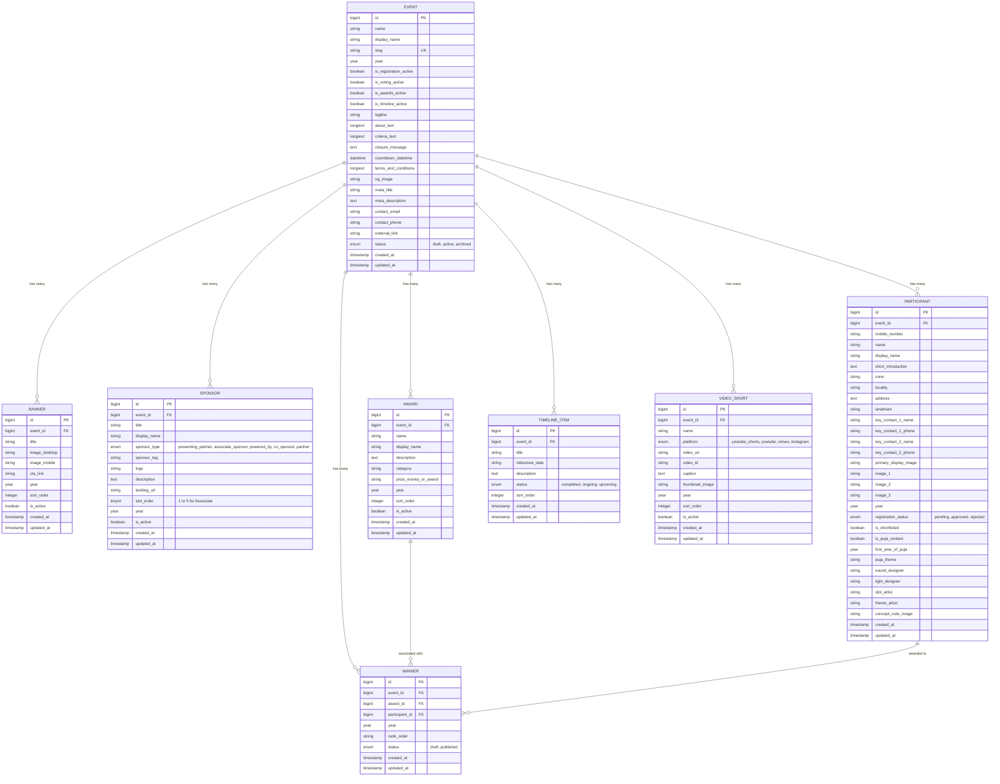

# Software Requirements Specification (SRS)

## Document Information
* **Project Name**: Dib 24x7 Event Microsite & Contest Management System
* **Document Version**: 1.0.0
* **Status**: Draft / Approved for Engineering
* **Author**: Engineering & Architecture Team
* **Target Audience**: Stakeholders, Project Managers, UI/UX Designers, Frontend & Backend Engineers, QA Engineers
* **Standard Compliance**: IEEE/ISO/IEC 29148:2018 Systems and Software Engineering — Requirements Engineering

---

## Table of Contents
1. [Introduction](#1-introduction)
   - 1.1 Purpose
   - 1.2 Document Conventions
   - 1.3 Intended Audience
   - 1.4 Product Scope
   - 1.5 Definitions, Acronyms, and Abbreviations
2. [Overall Description](#2-overall-description)
   - 2.1 Product Perspective
   - 2.2 Product Functions
   - 2.3 User Classes and Characteristics
   - 2.4 Operating Environment
   - 2.5 Design and Implementation Constraints
   - 2.6 Assumptions and Dependencies
3. [System Architecture & Data Model](#3-system-architecture--data-model)
   - 3.1 High-Level Architecture
   - 3.2 Entity-Relationship (ER) Diagram
   - 3.3 Data Dictionary
4. [External Interface Requirements](#4-external-interface-requirements)
   - 4.1 User Interfaces (UI Specifications)
   - 4.2 Hardware Interfaces
   - 4.3 Software & Storage Interfaces
   - 4.4 Communications & Network Interfaces
5. [System Features & Functional Requirements](#5-system-features--functional-requirements)
   - 5.1 Module 1: Event & Contest Master Management
   - 5.2 Module 2: Top Masthead & Sponsor Management
   - 5.3 Module 3: Above-The-Fold (ATF) Banner Carousel
   - 5.4 Module 4: Navbar & Navigation Controls
   - 5.5 Module 5: Event Countdown, About & Closure Engine
   - 5.6 Module 6: Participant / Candidate Master & Showcase (General & Puja-Specific)
   - 5.7 Module 7: Award & Category Master
   - 5.8 Module 8: Winner Master & Podium Showcase
   - 5.9 Module 9: Event Video Shorts & Media Reels
   - 5.10 Module 10: Event Timeline & Milestones
   - 5.11 Module 11: Terms & Conditions and Footer Integration
6. [Non-Functional Requirements (NFRs)](#6-non-functional-requirements-nfrs)
   - 6.1 Performance Requirements
   - 6.2 Security & Data Protection Requirements
   - 6.3 Availability & Reliability
   - 6.4 Maintainability & Extensibility
   - 6.5 Accessibility & SEO
7. [Verification & Acceptance Criteria](#7-verification--acceptance-criteria)
8. [Requirements Traceability Matrix (RTM)](#8-requirements-traceability-matrix-rtm)

---

## 1. Introduction

### 1.1 Purpose
This Software Requirements Specification (SRS) establishes the complete functional and non-functional requirements for the **Dib 24x7 Event Microsite and Contest Management Backend System**. It serves as the authoritative contract between product stakeholders, client sponsors, design teams, and development engineers.

### 1.2 Document Conventions
- **Requirement IDs**: Functional Requirements are designated as `FR-<Module>-<Number>` (e.g., `FR-EVT-01`).
- **Non-Functional Requirement IDs**: Designated as `NFR-<Category>-<Number>` (e.g., `NFR-SEC-01`).
- **Priorities**:
  - `[MUST]`: Mandatory core requirement for Release 1.0.
  - `[SHOULD]`: Highly desirable requirement; omitting requires change control approval.
  - `[COULD]`: Optional enhancement if time permits.

### 1.3 Intended Audience
- **Stakeholders & Client (Dib 24x7)**: Verifying alignment with commercial, brand, and promotional goals.
- **Frontend & Backend Developers**: Direct blueprint for coding, schema design, and API design.
- **QA Engineers**: Foundation for creating test matrices, automated tests, and acceptance test plans.

### 1.4 Product Scope
The system is an event-driven digital platform composed of:
1. **Public Event Microsite (Frontend)**: A high-performance, mobile-first web application featuring a multi-tiered sponsor masthead (Dib 24x7, Event Logo, Presenting Partner, and up to 5 Associate Sponsors), responsive ATF banner carousel, event overview with countdown clock, filterable participants showcase (including specialized Durga Puja cultural attributes), vertical video shorts, awards and winner podiums, milestone timeline, and terms & conditions.
2. **Administrative Management Portal (Backend)**: A secure management console allowing administrators to configure multiple events, manage multi-slot sponsors, upload device-specific media banners, shortlist candidates, link winners to awards, and control feature toggles (Registration, Voting, Awards, Timeline).

### 1.5 Definitions, Acronyms, and Abbreviations
| Term / Acronym | Definition |
| :--- | :--- |
| **ATF** | Above The Fold: The portion of the webpage visible without scrolling. |
| **Masthead** | Top header section of the website showcasing main entity and sponsor brand assets. |
| **Puja Contest** | Traditional cultural festival awards requiring specific metadata (Theme, Idol Artist, Light, Sound). |
| **CTA** | Call To Action (e.g., "Vote Now", "Register Here"). |
| **OG Image** | Open Graph image displayed when links are shared on social media (WhatsApp, Facebook, Twitter). |
| **Slug** | URL-friendly, human-readable unique identifier for an event page (e.g., `sharod-samman-2026`). |
| **RTM** | Requirements Traceability Matrix. |

---

## 2. Overall Description

### 2.1 Product Perspective
The Dib 24x7 Event Microsite serves as a branded flagship portal for high-impact annual and seasonal events. It operates as an autonomous web application within the Dib 24x7 digital ecosystem, designed to handle traffic spikes during festival seasons and voting windows.

```mermaid
graph LR
    subgraph "External Ecosystem"
        Visitors[Public Audience / Mobile Users]
        Sponsors[Sponsors & Brand Advertisers]
        AdminStaff[Dib 24x7 Event Operations]
        VideoProviders[YouTube / Vimeo / Instagram]
    end

    subgraph "Dib 24x7 Microsite Platform"
        FE[Microsite Frontend (Livewire 4 / Tailwind CSS / Alpine.js)]
        BE[Contest Management Backend (Laravel 13 / Filament PHP v5)]
        DB[(Relational DB: MySQL / SQLite)]
        Storage[Asset Storage: Logos, Banners, Photos, Concept Notes]
    end

    Visitors -->|Browse, View Candidates, Watch Shorts, Vote CTA| FE
    AdminStaff -->|Manage Events, Sponsors, Candidates, Winners| BE
    VideoProviders -->|Embed Shorts / Reels| FE
    Sponsors -->|Brand Placement & Click-Throughs| FE
    FE <--> BE
    BE <--> DB
    BE <--> Storage
    FE <--> Storage
```

### 2.2 Product Functions
1. **Event Lifecycle Orchestration**: Create, edit, toggle, and archive events by year and unique slug.
2. **Brand & Sponsor Commercialization**: Prominently display Dib 24x7, Presenting Partner, and 5 discrete Associate Sponsor slots with click tracking and external landing redirects.
3. **Dynamic Above-The-Fold Engagement**: Responsive desktop/mobile carousel banner with CTA action triggers.
4. **Interactive Candidate Showcase**: Zone and locality filtering for registered participants; specialized cultural attribute inspection modal (idol artist, theme, sound/light designers, concept notes).
5. **Shorts & Viral Media Engagement**: Vertical 9:16 video reels carousel optimized for mobile consumption.
6. **Contest Outcome Publishing**: Formal awards matrix and winner podium ranks (`1st`, `2nd`, `3rd`, `Special Mention`).
7. **Time-Sensitive Event Operations**: Automated countdown clock and dynamic state toggles governing voting, registration, timeline, and awards visibility.

### 2.3 User Classes and Characteristics
| User Class | Description | Technical Proficiency | Access Rights |
| :--- | :--- | :--- | :--- |
| **Public Visitor** | Everyday web users and mobile festival-goers browsing pandals, participants, and awards. | General Public / Mobile First | Read-only access to published event pages and modal views. |
| **Contest Candidate** | Representatives of clubs, pandals, or participants submitting entries. | Basic Web Skills | View status, bio, and images. |
| **Event Administrator** | Dib 24x7 operations team managing content, sponsors, approvals, and winners. | Moderate to Advanced | Full CRUD access to backend masters, publishing toggles, and media assets. |

### 2.4 Operating Environment
- **Local Development Environment**: Laravel Herd on Windows (Path: `E:\Herd\events`, Local Domain: `http://events.test`) running PHP 8.3.14.
- **Production Server Environment**: Shared Hosting Linux Server (cPanel / DirectAdmin / Apache / LiteSpeed) with **PHP 8.3** active runtime.
- **PHP Extensions**: Required modules enabled on PHP 8.3: `bcmath`, `ctype`, `curl`, `dom`, `fileinfo`, `gd`, `intl`, `json`, `mbstring`, `openssl`, `pdo_mysql`, `tokenizer`, `xml`, `zip`.
- **Web Server**: Apache with `mod_rewrite` enabled (`.htaccess` URL rewriting) or Nginx.
- **Database**: MySQL 8.0+ or MariaDB 10.5+ (InnoDB engine, utf8mb4 collation with 191-character index compatibility). SQLite supported for local testing.
- **Client Browsers**: Google Chrome (latest 3 versions), Safari iOS, Mozilla Firefox, Microsoft Edge, Samsung Internet.
- **Deployment Strategy**: Architecture configured for shared hosting file isolation (`~/core_app` outside public webroot, `~/public_html` hosting public entrypoint and pre-compiled Vite assets).

### 2.5 Design and Implementation Constraints
- **Framework Constraint**: Backend administration is built with **Filament PHP v5**, leveraging official Filament resource schemas, infolists, and relational managers. Codebase strictly adheres to modern Laravel 13 architectural guidelines (`laravel-best-practices`), including thin models, form requests, Eloquent casts, and fillable arrays.
- **Frontend Reactive Constraint**: Interactive frontend elements (search, zone filtering, candidate modals, video shorts) are developed with **Livewire 4**, providing single-roundtrip DOM diffing without heavy SPA overhead.
- **Sponsor Constraint**: Associate Sponsor top masthead allocation must strictly accommodate a maximum of **5 slots** simultaneously per event.
- **Responsive Media Constraint**: Banners must support distinct desktop (`1920x600`) and mobile (`768x960`) aspect ratios without server-side image distortion.
- **Zero-Hydration Overhead**: The frontend must load immediately without heavy client-side JavaScript hydration lag, utilizing lightweight Alpine.js, Livewire 4, and Tailwind CSS.

### 2.6 Assumptions and Dependencies
- Images uploaded by administrators are in standard web formats (JPG, PNG, WebP, SVG).
- Video shorts are hosted on standard third-party platforms (YouTube Shorts, YouTube, Vimeo, Instagram) and parsed via URL/embed IDs.
- Client maintains valid DNS and SSL certificates for HTTPS secure delivery.

---

## 3. System Architecture & Data Model

### 3.1 High-Level Architecture
The system employs a full-stack Laravel 13 architecture pairing **Livewire 4** reactive frontend components with **Filament PHP v5** administrative panels, sharing a unified reactive core, database layer, and storage disk.

### 3.2 Entity-Relationship (ER) Diagram



### 3.3 Data Dictionary

| Table Name | Field Name | Data Type | Nullable | Description / Constraints |
| :--- | :--- | :--- | :--- | :--- |
| `events` | `id` | BIGINT (PK) | No | Auto-increment primary key. |
| `events` | `slug` | VARCHAR(255) | No | Unique index, URL slug (`/event/{slug}`). |
| `events` | `status` | ENUM | No | `'draft'`, `'active'`, `'archived'`. Default: `'draft'`. |
| `events` | `is_registration_active` | BOOLEAN | No | Default `false`. Controls registration visibility. |
| `events` | `is_voting_active` | BOOLEAN | No | Default `false`. Controls "Vote Now" active state. |
| `events` | `is_awards_active` | BOOLEAN | No | Default `false`. Controls public winner podium display. |
| `events` | `is_timeline_active` | BOOLEAN | No | Default `true`. Controls timeline milestone section. |
| `sponsors` | `sponsor_type` | ENUM | No | `'presenting_partner'`, `'associate_sponsor'`, etc. |
| `sponsors` | `slot_order` | TINYINT | No | Integer `1` to `5` for Associate Sponsors. |
| `participants` | `mobile_number` | VARCHAR(20) | No | Indexed. Validated Indian phone format. |
| `participants` | `is_shortlisted` | BOOLEAN | No | Default `false`. Indexed for rapid shortlist filtering. |
| `participants` | `is_puja_contest` | BOOLEAN | No | Default `false`. Toggles display of Puja attributes. |
| `winners` | `rank_order` | VARCHAR(50) | No | e.g. `'1st'`, `'2nd'`, `'3rd'`, `'Special Jury'`. |
| `video_shorts` | `platform` | ENUM | No | `'youtube_shorts'`, `'youtube'`, `'vimeo'`, `'instagram'`. |

---

## 4. External Interface Requirements

### 4.1 User Interfaces (UI Specifications)

#### UI-01: Top Masthead & Sponsor Integration Bar
- **Desktop (>= 1024px)**:
  - Left zone: `Dib 24x7` Brand Logo (Fixed aspect ratio, high-res SVG/PNG).
  - Center-Left zone: Event Title / Event Brand Logo.
  - Center-Right zone: Presenting Partner Logo preceded by text label `"PRESENTED BY"`.
  - Right zone: Associate Sponsors container showcasing up to **5 sponsor slots** (`slot_order: 1..5`) with discrete borders, equal heights, hover zoom transitions, and external links.
- **Mobile (< 768px)**:
  - Top row: Dib 24x7 Logo + Event Logo + Presenting Partner Logo.
  - Second row: Horizontal swipeable or clean 2-3 column grid for Associate Sponsors with `"ASSOCIATE SPONSORS"` header.

#### UI-02: Sticky Navigation Bar
- Positioned directly below the masthead; sticks to top on scroll (`sticky top-0 z-50`).
- Menu items: `About the Awards`, `Selection Criteria`, `Timeline`, `Participants Showcase`, `Event Shorts`, `Terms & Conditions`.
- Primary CTA: **"Vote Now"** button rendered in a prominent high-contrast pill style. When `is_voting_active` is true, displays pulse animation; when false, renders grayed state or `"Voting Closed"`.

#### UI-03: Above-The-Fold (ATF) Banner Carousel
- Responsive image delivery using `<picture>` markup:
  - Desktop viewport: Serves `image_desktop` (1920x600px aspect ratio).
  - Mobile viewport: Serves `image_mobile` (768x960px aspect ratio).
- Auto-scroll with 5-second interval, pause on hover/touch, navigation indicator dots, and direct CTA button linking to `cta_link`.

#### UI-04: Participants Showcase & Puja Candidate Lightbox
- Search input and filter badges for `Zone` (North, South, Central, East, West, Howrah) and `Shortlisted Only` toggle.
- Grid of candidate cards showing Primary Display Image, Candidate Name, Locality, and Puja Theme.
- Clicking any card opens a full modal:
  - Image carousel: Primary Image + Images 1, 2, 3.
  - Candidate details: Address, Landmark, Key Contact Names & Numbers.
  - Puja section (if `is_puja_contest` is true): First Year of Puja, Puja Theme, Idol Artist, Light Designer, Sound Designer, Theme Artist, and Concept Note image lightbox.

#### UI-05: 9:16 Vertical Video Shorts Gallery
- Responsive multi-card carousel formatted for 9:16 aspect ratio reels.
- Displays thumbnail, play icon overlay, video title, and platform badge (YouTube Shorts / Vimeo / Instagram).
- Clicking opens a video playback modal without reloading the page.

#### UI-06: Awards & Winners Podium
- Awards section: Displays all awards with category badges and cash prize / trophy info.
- When `is_awards_active` is enabled:
  - Winners podium showcases 1st (Gold), 2nd (Silver), 3rd (Bronze), and Special Mentions linked to corresponding Candidate profiles.

#### UI-07: Admin Management Console
- Clean administrative layout with navigation sidebar for all 8 master modules.
- Dynamic form validation feedback, drag/number sorting, image upload previews, and active status toggles.

### 4.2 Hardware Interfaces
No specialized hardware required; runs on standard commodity servers and end-user computing devices (Smartphones, Tablets, Laptops, Desktops).

### 4.3 Software & Storage Interfaces
- **Laravel Storage Disk (`public`)**: Manages uploaded assets under organized subdirectories (`storage/app/public/events/{id}/banners/`, `sponsors/`, `participants/`).
- **CDN / Web Cache**: Static assets configured with cache-control headers (`max-age=31536000, immutable`).

### 4.4 Communications & Network Interfaces
- All client-server communication occurs over secure HTTPS (TLS 1.2/1.3).
- RESTful HTTP requests for admin CRUD operations and public microsite rendering.

---

## 5. System Features & Functional Requirements

### 5.1 Module 1: Event & Contest Master Management
- **FR-EVT-01 [MUST]**: The system shall allow an administrator to create and update an event with the following fields:
  - Event Name (`name`)
  - Event Display Name (`display_name`)
  - Year (`year`)
  - Page Slug (`slug` - unique, alphanumeric with hyphens)
  - Registration Status (`is_registration_active` - toggle)
  - Voting Status (`is_voting_active` - toggle)
  - Awards Status (`is_awards_active` - toggle)
  - Timeline Status (`is_timeline_active` - toggle)
  - About the Event (`about_text` - rich text / HTML)
  - Event Tagline (`tagline`)
  - Selection Criteria (`criteria_text` - rich text / HTML)
  - Closure Message (`closure_message`)
  - Countdown Date Time (`countdown_datetime`)
  - Terms & Conditions (`terms_and_conditions` - rich text / HTML)
  - OG Image (`og_image` - file upload)
  - Page Meta Title (`meta_title`)
  - Page Meta Description (`meta_description`)
  - Contact Email (`contact_email`)
  - Contact Phone (`contact_phone`)
  - External Link (`external_link`)
  - Event Status (`status` - `'draft'`, `'active'`, `'archived'`).
- **FR-EVT-02 [MUST]**: The public URL `/` shall automatically route to the current active flagship event, or `/events/{slug}` for specific events.
- **FR-EVT-03 [MUST]**: If an event status is `'draft'`, non-admin visitors shall receive an HTTP 404 or maintenance notice.

### 5.2 Module 2: Top Masthead & Sponsor Management
- **FR-SPO-01 [MUST]**: The system shall provide an admin management module for Sponsors with:
  - Sponsor Title (`title`)
  - Sponsor Display Name (`display_name`)
  - Sponsor Type (`sponsor_type`: `'presenting_partner'`, `'associate_sponsor'`, `'powered_by'`, `'co_sponsor'`, `'partner'`)
  - Sponsor Tag (`sponsor_tag`, e.g., "Main Sponsor", "Associate Partner")
  - Sponsor Logo (`logo` - file upload, PNG/SVG/WebP)
  - Sponsor Description (`description`)
  - Sponsor Landing URL (`landing_url`)
  - Associated Event/Contest (`event_id`)
  - Year (`year`)
  - Status (`is_active` - toggle)
  - Slot Order (`slot_order` - integer `1` to `5`).
- **FR-SPO-02 [MUST]**: The frontend masthead shall render:
  - Dib 24x7 Main Entity Logo.
  - Active Event Logo / Display Name.
  - Presenting Partner Logo with `"Presented by"` identifier.
  - A maximum of **5 Associate Sponsor slots** rendered cleanly in designated slots.
- **FR-SPO-03 [MUST]**: Clicking any sponsor logo shall open the `landing_url` in a new browser tab with `rel="noopener noreferrer"`.

### 5.3 Module 3: Above-The-Fold (ATF) Banner Carousel
- **FR-BAN-01 [MUST]**: The system shall provide an ATF banner management module with:
  - Banner Title (`title`)
  - Desktop Banner Image (`image_desktop` - minimum width 1920px recommended)
  - Mobile Banner Image (`image_mobile` - minimum width 768px recommended)
  - CTA Link (`cta_link` - valid URL or internal anchor)
  - Associated Event/Contest (`event_id`)
  - Year (`year`)
  - Sort Order (`sort_order`)
  - Status (`is_active` - toggle).
- **FR-BAN-02 [MUST]**: The frontend carousel shall dynamically serve `image_desktop` on viewports `>= 768px` and `image_mobile` on viewports `< 768px`.
- **FR-BAN-03 [SHOULD]**: The carousel shall support auto-rotation every 5 seconds, manual navigation dots, swipe gestures on touch screens, and pause-on-hover.

### 5.4 Module 4: Navbar & Navigation Controls
- **FR-NAV-01 [MUST]**: The sticky navigation bar shall contain smooth-scroll navigation links:
  - `About the Awards` (`#about-awards`)
  - `Selection Criteria` (`#criteria`)
  - `Timeline` (`#timeline`)
  - `Participants` (`#participants`)
  - `Event Shorts` (`#shorts`)
- **FR-NAV-02 [MUST]**: The navbar shall include a prominent **"Vote Now"** CTA button.
  - If `is_voting_active` is true: Button is fully active, highlighted with accent colors and pulse animation, directing to voting section or external voting URL.
  - If `is_voting_active` is false: Button renders as "Voting Closed" or disables click action.

### 5.5 Module 5: Event Countdown, About & Closure Engine
- **FR-CNT-01 [MUST]**: The system shall display a real-time countdown timer calculating days, hours, minutes, and seconds until `countdown_datetime`.
- **FR-CNT-02 [MUST]**: When current time exceeds `countdown_datetime`, the timer shall automatically display the configured `closure_message` without requiring manual page redevelopment.
- **FR-CNT-03 [MUST]**: The "About the Event" section shall render the event tagline and rich-text `about_text` with clean typographic formatting.

### 5.6 Module 6: Participant / Candidate Master & Showcase
- **FR-PAR-01 [MUST]**: The backend candidate master shall manage:
  - Mobile Number (`mobile_number` - Indian 10-digit validation)
  - Associated Event/Contest (`event_id`)
  - Participant Name (`name`)
  - Participant Display Name (`display_name`)
  - Short Introduction (`short_introduction`)
  - Zone (`zone`, e.g., North, South, Central, East, West, Howrah)
  - Locality (`locality`)
  - Address (`address`)
  - Landmark (`landmark`)
  - Key Contact 1 Name & Phone (`key_contact_1_name`, `key_contact_1_phone`)
  - Key Contact 2 Name & Phone (`key_contact_2_name`, `key_contact_2_phone`)
  - Primary Display Image (`primary_display_image` - required upload)
  - Additional Gallery Images (`image_1`, `image_2`, `image_3` - optional uploads)
  - Year (`year`)
  - Registration Status (`registration_status`: `'pending'`, `'approved'`, `'rejected'`)
  - Is Shortlisted (`is_shortlisted` - boolean toggle).
- **FR-PAR-02 [MUST]**: The system shall support conditional **Puja Contest Fields**:
  - First Year of Puja (`first_year_of_puja` - year)
  - Puja Theme (`puja_theme` - string)
  - Sound Designer (`sound_designer` - string)
  - Light Designer (`light_designer` - string)
  - Idol Artist (`idol_artist` - string)
  - Theme Artist (`theme_artist` - string)
  - Concept Note (`concept_note_image` - file upload).
- **FR-PAR-03 [MUST]**: The frontend Participants Showcase shall provide instant filtering by:
  - Zone dropdown selector.
  - Locality search query.
  - "Shortlisted Only" toggle switch.
- **FR-PAR-04 [MUST]**: Clicking any candidate card shall open an accessible modal containing full high-resolution images (Primary + 1, 2, 3), concept note preview, artist credits, and contact landmarks.

### 5.7 Module 7: Award & Category Master
- **FR-AWD-01 [MUST]**: The backend award master shall manage:
  - Award Name (`name`)
  - Award Display Name (`display_name`)
  - Award Description (`description`)
  - Award Category (`category`, e.g., Best Puja, Best Idol, Best Environment, People's Choice)
  - Prize Money / Award Details (`prize_money_or_award`, e.g., "₹1,00,000 + Trophy")
  - Associated Event/Contest (`event_id`)
  - Year (`year`)
  - Sort Order (`sort_order`)
  - Status (`is_active` - toggle).
- **FR-AWD-02 [MUST]**: The frontend shall display awards grouped by category with prize specifications and selection criteria.

### 5.8 Module 8: Winner Master & Podium Showcase
- **FR-WIN-01 [MUST]**: The backend winner master shall link:
  - Event (`event_id`)
  - Award (`award_id`)
  - Participant / Candidate (`participant_id`)
  - Year (`year`)
  - Rank / Order (`rank_order`: `'1st'`, `'2nd'`, `'3rd'`, `'Special Mention'`, etc.)
  - Publication Status (`status`: `'draft'`, `'published'`).
- **FR-WIN-02 [MUST]**: When the event toggle `is_awards_active` is enabled, the frontend shall reveal the Winners Podium showcasing ranked candidates with award badges and photos.

### 5.9 Module 9: Event Video Shorts & Media Reels
- **FR-VID-01 [MUST]**: The backend video shorts master shall manage:
  - Video Name (`name`)
  - Video Platform (`platform`: `'youtube_shorts'`, `'youtube'`, `'vimeo'`, `'instagram'`)
  - Video URL (`video_url`)
  - Video Caption (`caption`)
  - Video Thumbnail Image (`thumbnail_image` - file upload)
  - Year (`year`)
  - Status (`is_active` - toggle).
- **FR-VID-02 [MUST]**: The system shall parse and store embed video IDs from standard URLs (`youtube.com/shorts/{id}`, `youtu.be/{id}`).
- **FR-VID-03 [MUST]**: The frontend shall display vertical 9:16 aspect ratio reel cards. Clicking a card shall trigger a modal embed player without layout breaking.

### 5.10 Module 10: Event Timeline & Milestones
- **FR-TIM-01 [MUST]**: The backend shall manage timeline milestones with Title, Date Label, Description, Status (`'completed'`, `'ongoing'`, `'upcoming'`), and Sort Order.
- **FR-TIM-02 [MUST]**: If `is_timeline_active` is true, the frontend shall render a vertical visual timeline tracking event milestones.

### 5.11 Module 11: Terms & Conditions and Footer Integration
- **FR-TRM-01 [MUST]**: The frontend shall render the rich-text Terms & Conditions within an accessible collapsible accordion or modal.
- **FR-TRM-02 [MUST]**: The footer shall display Dib 24x7 copyright notices, contact phone (`contact_phone`), contact email (`contact_email`), and external links (`external_link`).

---

## 6. Non-Functional Requirements (NFRs)

### 6.1 Performance Requirements
- **NFR-PERF-01 [MUST]**: The microsite frontend initial payload (HTML + CSS) shall render within **1.5 seconds** on a standard 4G mobile connection.
- **NFR-PERF-02 [MUST]**: Lighthouse Performance score shall maintain `>= 85` on mobile and `>= 95` on desktop.
- **NFR-PERF-03 [MUST]**: All uploaded images (banners, logos, candidate photos) shall be lazily loaded (`loading="lazy"`) and optimized.
- **NFR-PERF-04 [MUST]**: The database queries shall utilize eager loading (`with()`) for all relational lookups to eliminate N+1 query overhead.

### 6.2 Security & Data Protection Requirements
- **NFR-SEC-01 [MUST]**: All form submissions in the admin console shall enforce CSRF token validation (`@csrf`).
- **NFR-SEC-02 [MUST]**: Administrative endpoints (`/admin/*`) shall be protected behind authentication middleware and role checks.
- **NFR-SEC-03 [MUST]**: File uploads shall strictly enforce MIME type whitelisting (`image/jpeg, image/png, image/webp, image/svg+xml`) and maximum size constraints (4MB for photos, 2MB for logos).
- **NFR-SEC-04 [MUST]**: All user inputs rendered in views shall be sanitized to protect against Cross-Site Scripting (XSS).
- **NFR-SEC-05 [MUST]**: Eloquent ORM parameterized queries shall be strictly utilized to guarantee SQL injection immunity.

### 6.3 Availability & Reliability
- **NFR-REL-01 [MUST]**: The application shall achieve 99.9% uptime during active festival and voting campaign windows.
- **NFR-REL-02 [MUST]**: Database migrations shall incorporate foreign key cascades ensuring data integrity when events or candidates are deleted.

### 6.4 Maintainability & Extensibility
- **NFR-MAINT-01 [MUST]**: Codebase shall strictly adhere to PSR-12 coding standards and the official `laravel-best-practices` guidelines.
- **NFR-MAINT-02 [MUST]**: Modular Blade components (`<x-masthead />`, `<x-banner-carousel />`, `<x-participant-card />`) shall be used to ensure high reusability for future annual editions.
- **NFR-MAINT-03 [MUST]**: **Decoupled Frontend Component Architecture**: Visual frontend sections shall be implemented as atomic, markup-agnostic Blade/Livewire components without inline database queries, ensuring future custom agency HTML/CSS themes can be dropped in without altering backend business logic.
- **NFR-MAINT-04 [MUST]**: **Headless REST API Readiness**: The platform shall expose versioned REST API endpoints (`/api/v1/events/{slug}`, `/participants`, `/shorts`, `/winners`), enabling headless SPA, Next.js/React, Nuxt/Vue, or mobile apps to interface seamlessly with the backend.

### 6.5 Accessibility & SEO
- **NFR-A11Y-01 [SHOULD]**: The frontend shall conform to WCAG 2.1 Level AA standards, ensuring accessible color contrast ratios and keyboard navigability.
- **NFR-SEO-01 [MUST]**: Every event shall render dynamic Open Graph meta tags (`og:title`, `og:description`, `og:image`, `og:url`) enabling rich previews across WhatsApp, Facebook, and Twitter.

---

## 7. Verification & Acceptance Criteria

| ID | Verification Item | Method | Acceptance Criteria |
| :--- | :--- | :--- | :--- |
| **AC-01** | Top Masthead Multi-Tier Sponsors | Visual & DOM Inspection | Dib 24x7 logo, Event logo, Presenting Partner, and up to 5 Associate Sponsors display correctly with outbound links. |
| **AC-02** | ATF Banner Responsive Switching | Device Viewport Emulation | Viewport `>= 768px` downloads `image_desktop`; viewport `< 768px` downloads `image_mobile`. |
| **AC-03** | Associate Sponsor Limit | Automated Test | System restricts or validates that maximum 5 associate sponsor slots appear in the masthead. |
| **AC-04** | "Vote Now" CTA Reactive State | Manual & Functional Test | When `is_voting_active` is toggled off in admin, button reflects closed state on frontend immediately. |
| **AC-05** | Countdown & Closure Message | Clock Shift Simulation | When current time passes `countdown_datetime`, countdown is replaced by `closure_message`. |
| **AC-06** | Participant Puja Details Lightbox | User Interaction Test | Clicking a Puja candidate card displays idol artist, theme artist, light designer, sound designer, and concept note. |
| **AC-07** | Video Shorts Aspect Ratio | Visual Layout Test | Video cards maintain vertical 9:16 aspect ratio on both mobile and desktop screens. |
| **AC-08** | Winner Podium Linkage | Database & View Test | Linking event, award, and participant correctly outputs the ranked winner on the public podium when `is_awards_active = true`. |

---

## 8. Requirements Traceability Matrix (RTM)

| Client Requirement | Functional Req ID | Model / Entity | Frontend View / Component | Test Case ID |
| :--- | :--- | :--- | :--- | :--- |
| **Main entity logo (Dib 24x7)** | `FR-SPO-02` | Static Asset / Config | `components/masthead.blade.php` | `TC-MAST-01` |
| **Event logo & display name** | `FR-EVT-01` | `Event` | `components/masthead.blade.php` | `TC-MAST-02` |
| **Presenting partner logo** | `FR-SPO-01`, `02`| `Sponsor` | `components/masthead.blade.php` | `TC-MAST-03` |
| **Associate sponsors (Max 5 slots)**| `FR-SPO-01`, `02`| `Sponsor` | `components/masthead.blade.php` | `TC-MAST-04` |
| **ATF Banner (Desktop & Mobile)** | `FR-BAN-01`, `02`| `Banner` | `components/banner-carousel.blade.php`| `TC-BAN-01` |
| **Navbar (About, Criteria, Timeline, Vote)**| `FR-NAV-01`, `02`| `Event` | `components/navbar.blade.php` | `TC-NAV-01` |
| **Countdown date time & Closure message** | `FR-CNT-01`, `02`| `Event` | `components/countdown.blade.php` | `TC-CNT-01` |
| **Participants showcase & Puja fields**| `FR-PAR-01`, `02`| `Participant` | `components/participant-showcase.blade.php`| `TC-PAR-01` |
| **Event video shorts (9:16)** | `FR-VID-01`, `02`| `VideoShort` | `components/video-shorts.blade.php` | `TC-VID-01` |
| **Award master & prize money** | `FR-AWD-01`, `02`| `Award` | `components/awards-winners.blade.php`| `TC-AWD-01` |
| **Winner master (Rank 1st, 2nd...)** | `FR-WIN-01`, `02`| `Winner` | `components/awards-winners.blade.php`| `TC-WIN-01` |
| **Timeline milestones** | `FR-TIM-01`, `02`| `TimelineItem` | `components/timeline.blade.php` | `TC-TIM-01` |
| **Terms and conditions** | `FR-TRM-01` | `Event` | `components/terms-footer.blade.php` | `TC-TRM-01` |
